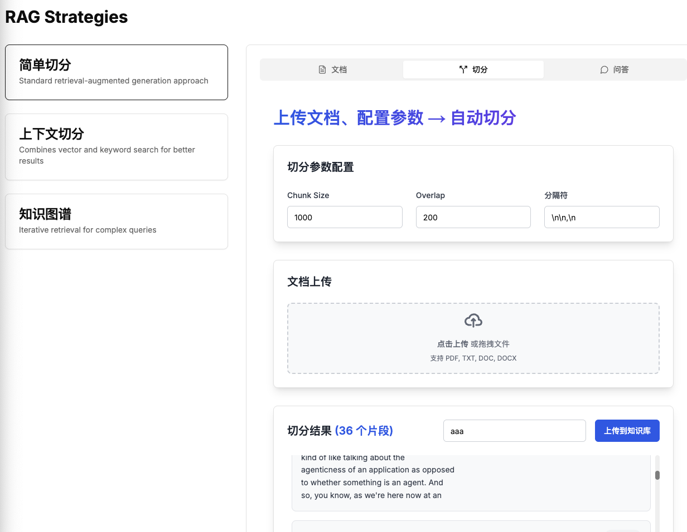

# RAG 策略系统


最全的 RAG 的所有策略



## 技术栈

### 后端
- FastAPI：高性能的 Python Web 框架
- LangChain：用于构建 LLM 应用
- Uvicorn：ASGI 服务器
- Poetry：依赖管理

### 前端
- Next.js：React 框架
- TypeScript：类型安全的 JavaScript
- Tailwind CSS：样式框架
- ESLint：代码质量工具


## 项目结构

```
.
├── backend/           # 后端服务
│   ├── main.py       # 主应用入口
│   └── requirements.txt
└── front/            # 前端应用
    ├── app/         # 页面组件
    ├── components/  # 可复用组件
    └── public/      # 静态资源
```
